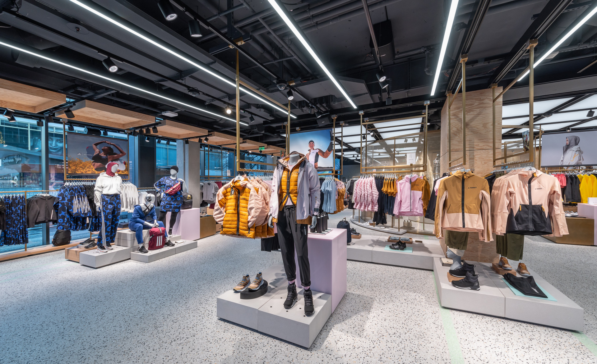
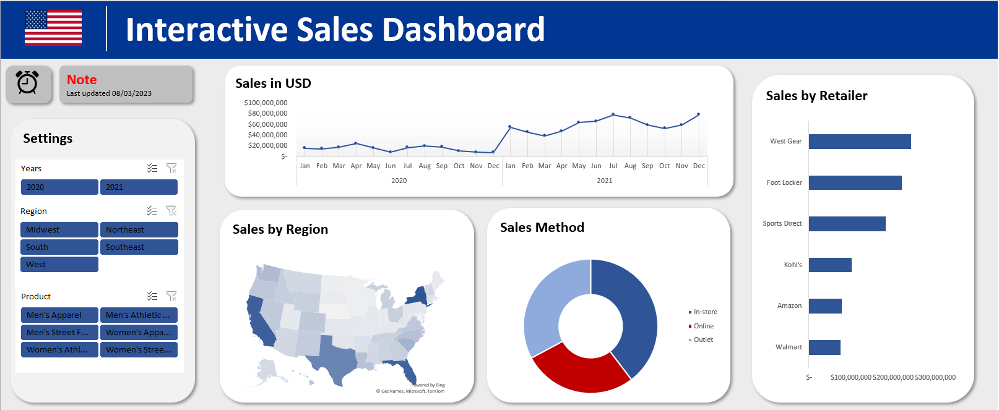

# Adidas-US-sales-for-2020-and-2021

## Introduction
This is a MS excel project with a dummy data set on the sales analysis of Adidas stores in the United States. The project is to analyze and derive insights to answer crucial questions and help the business make data driven decisions.

**_Disclaimer_** : _All datasets and reports do not actually represent ''Adidas'' but is just a dummy dataset to demonstrate some capabilities of MS excel._

## Concepts demonstrated

The following MS excel features were incorporated - 

- Formulars
- Filters
- Text to column
- Find and replace
- Conditional formatting
- Pivot chart
- Graphs

##  Problem Statement
1. What are the sales by regions in the years under review?
2. What are the total values of the various sales methods and the percentage?
3. What is the total sales in USD for the years under review?

## Data Sourcing

Not until I came up with the above mentioned questions did I go ahead to get the data. I then downloaded the csv file and extracted it into MS excel for cleaning, analysis and visualization.

It contains 9647 rows and 14 columns of data after cleaning.

## Data Transformation/Cleaning: 

Data was efficiently cleaned and transformed with MS excel tools. Some of the steps applied included:

- Find and replace
- Conditinal formatting
- Making first row as headers in table
- Analytic transformation of invoice date
- Text to columns
- Created a new column for total sales
- Added conditional formating to assign a numeric value to the return resonse of YES and NO. If YES then 1, else 0
- Data type changed from ''TEXT'' to ''WHOLE NUMBER''
- Removing duplicates

## Visualization

This is an interactive dashboard
You can interact with the report [here](https://introanalyst-my.sharepoint.com/:x:/g/personal/preyefiyai_introanalyst_onmicrosoft_com/Eb5zA6jrE45HvyR69Nv0T-wBlc9HFmBUWq5SGAD7b6U25w?e=XE33ue)

## Insights

- Sales was higest in the west region with over 83 million dollars.
- Sales was least in the mid west region totalling about 136 million dollars.
- There are 5 product categories in the stores and a sum of 247,8861 units were sold.
- The highest amount of sales were made via the In-store sales method.
- The least amount of sales was  recorded from Nebraska state in the midwest region.
- Total sales = 899,902,125

## Recommendation
For a deep dive into the analytics, the datasets from the previous years will be required for comparison and data driven decision making.

